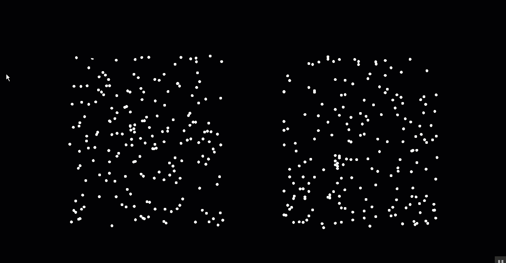
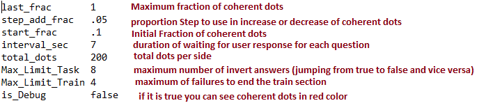

# Random Dot Kinematogram (RDK) with Unity

## This program consists of two secion : ##
- #### Train section :  ####
    - In this section there is a train scenario that ends after special number of failures. 
    the failure upper bound can be set in the config.txt file.  
    - After each failure, trainee would be informed by showing visual and audio noise effects. 
    
- #### Actual task :  ####
    Task tries to measure threshold of a person as soon as possible by a measuring method that uses a mechanism like  ["slow start"](https://en.wikipedia.org/wiki/TCP_congestion_control) 

  

- #### Rules :  ####
   There is only a simple rule. candidate should try to find the coherent flow of dots and decide which side of screen it occurs by pressing the corresponding Arrow (Left Arrow/Right Arrow)

- #### Config File ####
    - To add flexibility to exprement, Task or Train will read options from a txt file config.txt that should be copied in *D* drive(*D:\config.txt*).
    - The [*config.txt*](config.txt) consists of lines of options that can be set as shown in below figure with descreption in red lines :

      

